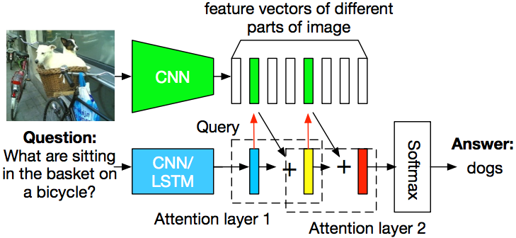
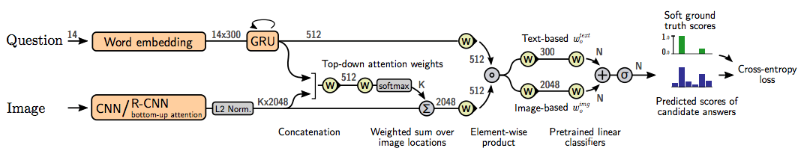

# NLP2022Summer_Vqa

## Introduction

本仓库包含浙江大学2022春夏自然语言处理大作业内容：回答VQA问题。其中，我们主要使用特征融合与注意力堆叠的方法，如下图：

<center>
    
    
</center>

模型结构主要参考以下文献

1. [Stacked attention networks for image question answering](https://openaccess.thecvf.com/content_cvpr_2016/papers/Yang_Stacked_Attention_Networks_CVPR_2016_paper.pdf)
2. [Tips and tricks for visual question answering: Learnings from the 2017 challenge](https://openaccess.thecvf.com/content_cvpr_2018/papers/Teney_Tips_and_Tricks_CVPR_2018_paper.pdf)

## Overview

文件结构如下：

```
│   main.py
│   README.md
│   .gitignore
│   test.ipynb
│   test_stacked.ipynb
├───data
│   │   __init__.py
│   │   dataset.py
│   │
│   ├───glove.6B
│   │
│   ├───vqa
│   │   │
│   │   ├───annotations
│   │   │       test.json
│   │   │       train.json
│   │   │       val.json
│   │   │
│   │   └───questions
│   │           test.json
│   │           train.json
│   │           val.json
│   │
│   └───preprocess
├───engine
│       __init__.py
│       trainer_mindspore.py
│
├───model
│       __init__.py
│       image_attention.py
│       model_mindspore.py
│       non_linear.py
│       question_embedding.py
│
├───utils
│       __init__.py
│       tokenizer.py
│       vqaevaluate.py
│
├───config
│       __init__.py
│       config_mindspore.py
│
└───pics
        stack.png
        feat_fusion.png
```

除了所示结构外，还需手动添加以下文件：

```
/data/glove.6B/glove.6B.300d.txt
/data/vqa/image_features.pkl
```

## Getting started 

程序的运行环境为python 3.7，mindposre 1.3.0。模型支持notebook运行，命令行运行两种方式，其中命令行运行输入如下：

```
python main.py \
--question-dir data/vqa/questions \
--image-path data/vqa/image_features.pkl \
--answer-dir data/vqa/annotations \
--glove-dir data/glove.6B \
```


 

